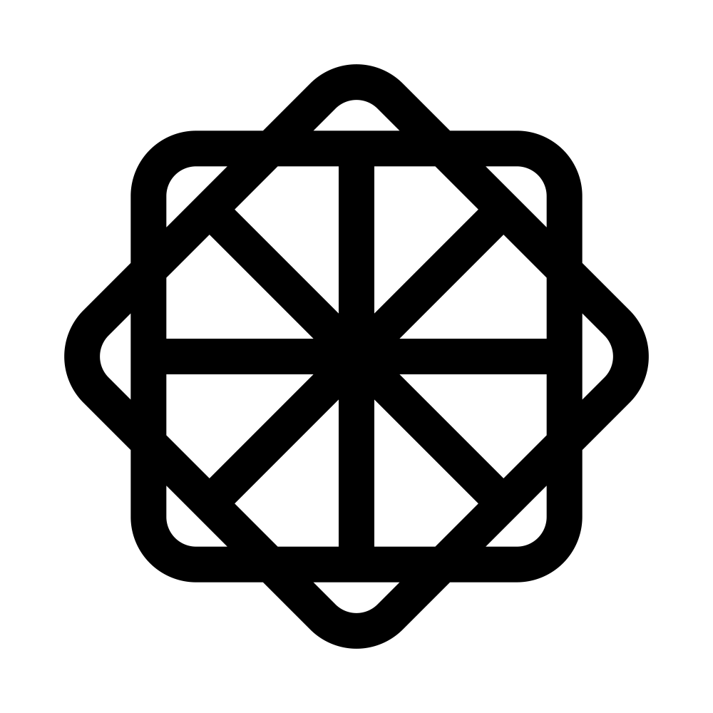

# Welcome to Karuha Github 👋
This is the GitHub page created by Karuha, the author of the Karunia Universe.
## I'm...
A student majoring in artificial intelligence.

-  [Div. of Software](https://sw.hallym.ac.kr/) at Hallym University (2023/03-2025/02)  
-  [Div. of Computer Engineering](https://hansung.ac.kr/CSE/index.do) at Hansung Univ. (2025/03-2026/02)  
-  [Dept. of Artificial Intelligence](https://cais.yonsei.ac.kr/) at Yonsei Univ. (since 2026/03)  

 

## Introduction to Karunia Characters
### 1. Ruha 
- 
- Icon: 
- Birthday: Mar 12
- Height: 185cm
- Weight: 70kg
- Shoe size: 285mm
- Symbol: Tree 🌲

### 2. Rina
- 
- Icon: 
- Birthday: Apr 17
- Height: 170cm
- Weight: 50kg
- Shoe size: 250mm
- Symbol: Flower 🌸
<!--
**Karuha12/Karuha12** is a ✨ _special_ ✨ repository because its `README.md` (this file) appears on your GitHub profile.

Here are some ideas to get you started:

- 🔭 I’m currently working on ...
- 🌱 I’m currently learning ...
- 👯 I’m looking to collaborate on ...
- 🤔 I’m looking for help with ...
- 💬 Ask me about ...
- 📫 How to reach me: ...
- 😄 Pronouns: ...
- ⚡ Fun fact: ...
-->
