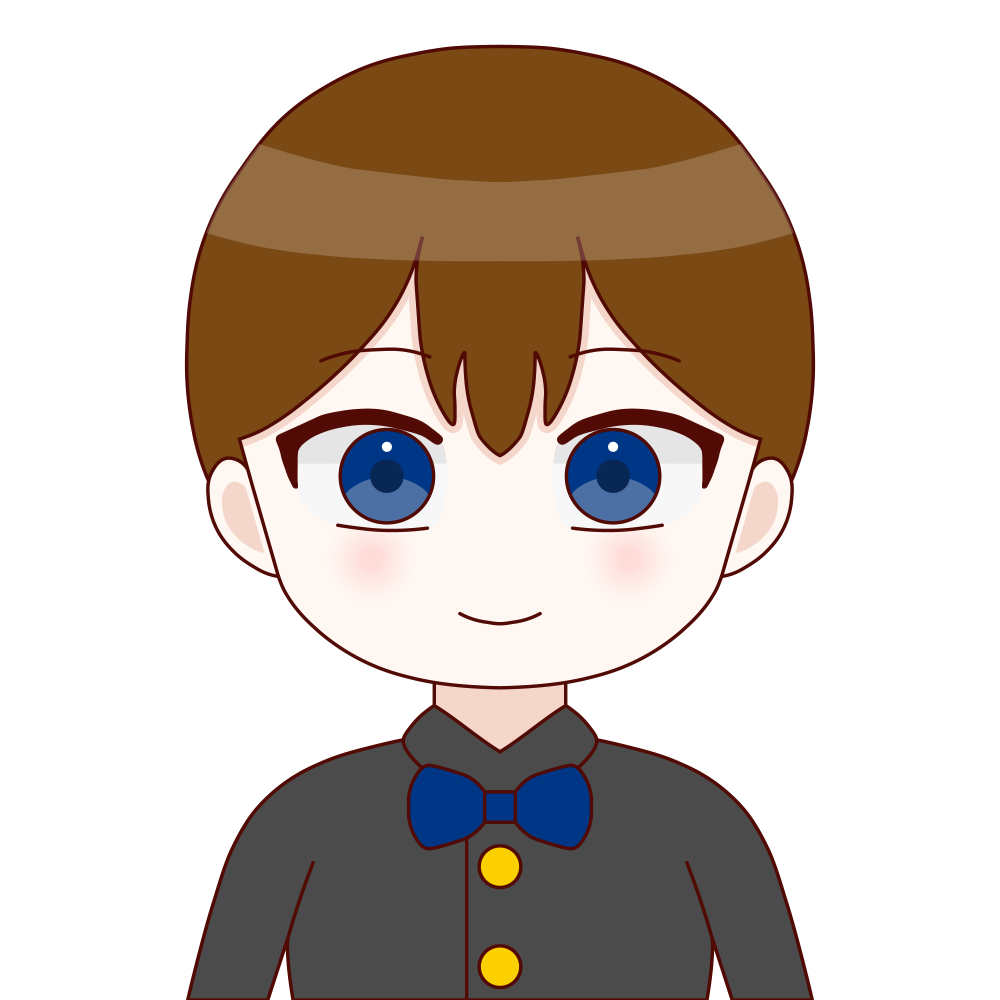
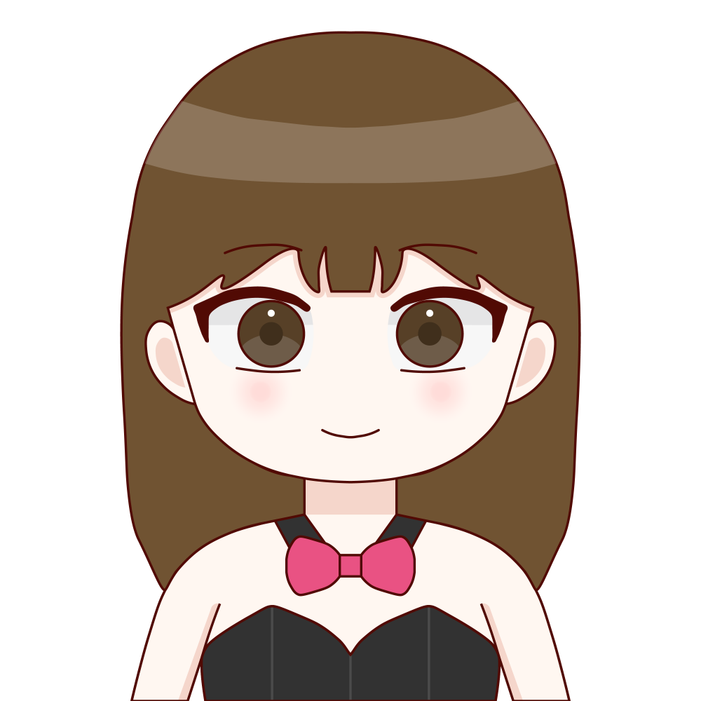
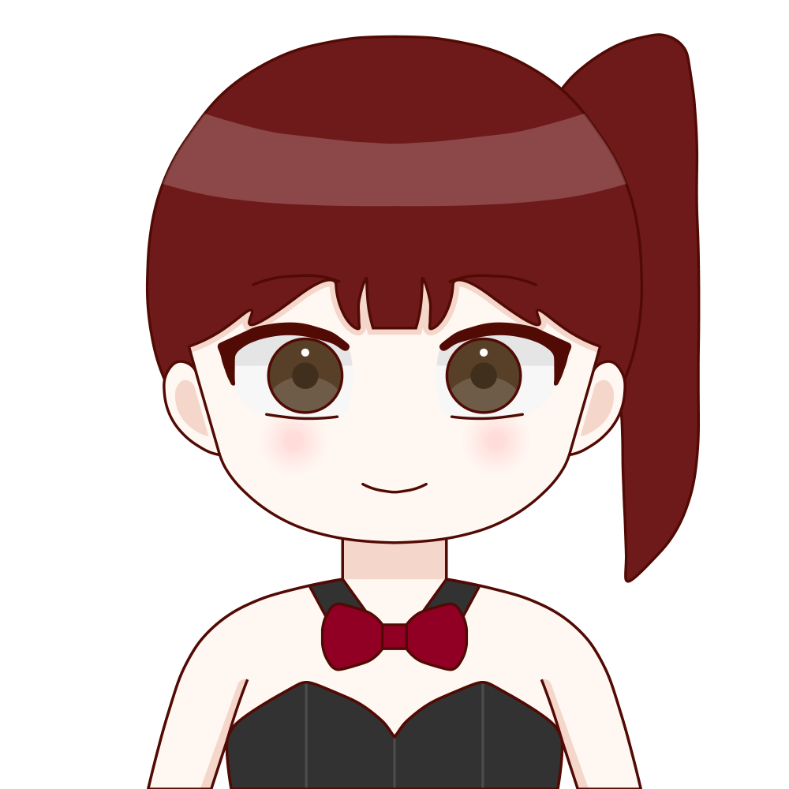
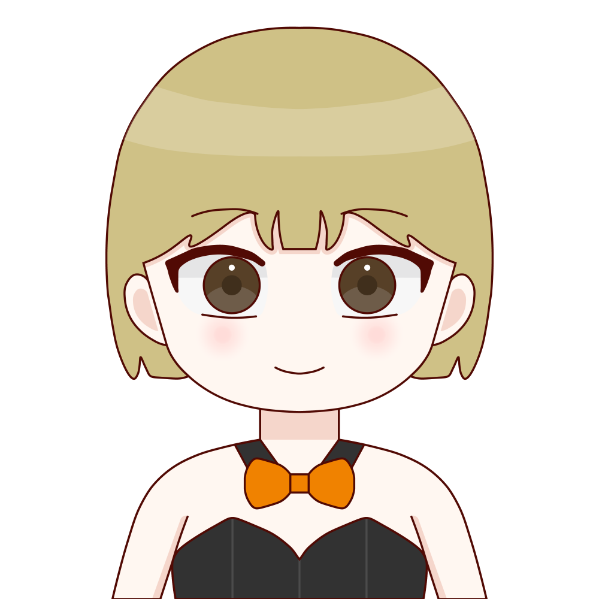

# Welcome to Karuha Github 👋
This is the GitHub page created by Karuha, the author of the Karunia Universe.
## I'm...
A student majoring in artificial intelligence.

-  [Div. of Software](https://sw.hallym.ac.kr/) at Hallym University (2023/03-2025/02)  
-  [Div. of Computer Engineering](https://hansung.ac.kr/CSE/index.do) at Hansung Univ. (2025/03-2026/02)  
-  [Dept. of Artificial Intelligence](https://cais.yonsei.ac.kr/) at Yonsei Univ. (since 2026/03)  

 

## The Five Main Karunia Characters
|Name|Icon|Portrait|Gender|Birthday|Body|Emoji|
|---|---|---|---|---|---|---|
|Ruha·루하·ルハ|||Male|Mar 12|185cm·70kg·285mm|🌲|
|Rina·리나·リナ|||Female|Apr 17|170cm·50kg·250mm|🌸|
|Doha·도하·ドハ|||Male|May 22|180cm·65kg·280mm|🌿|
|Mina·미나·ミナ|||Female|Jun 27|165cm·50kg·245mm|🍯|
|Yuha·유하·ユハ|||Female|Jul 2|165cm·47kg·245mm|🍊|
